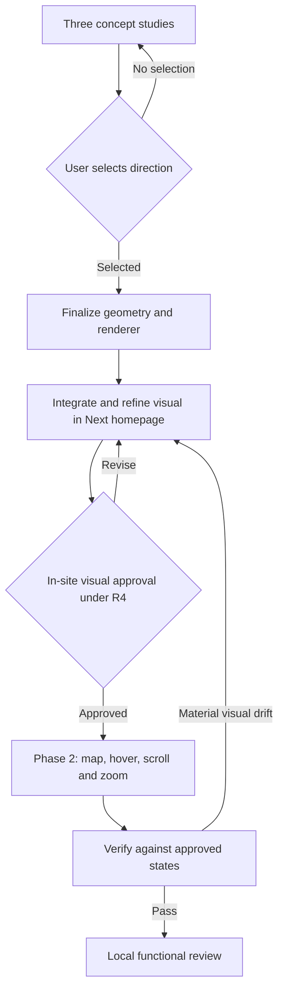
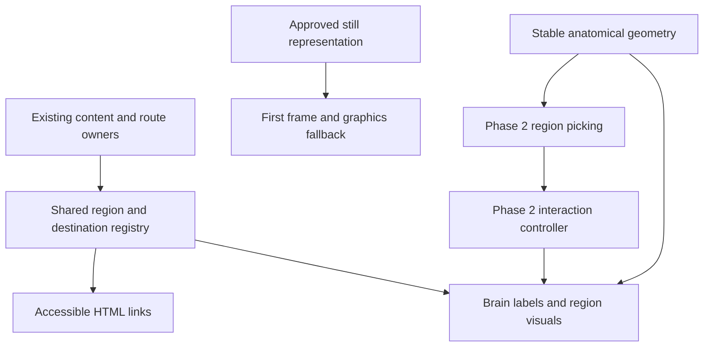

# SOF Brain Design and Integration - Plan

## Goal Capsule

- **Objective:** Visitors experience SOF as a precise, connected intelligence through an unmistakably anatomical brain that becomes the website's central visual map.
- **Means:** Compare three visual directions, integrate the user's choice, then add interaction through the approval sequence in R3 and R4.
- **Authority:** The user's instructions govern scope and approval. Requirements govern behavior; technical decisions govern implementation within those requirements.
- **Execution profile:** Design-led, local, and iterative. This plan is ready to begin Phase 1; later units remain conditional on their stated gates.
- **Stop conditions:** Pause at concept selection and at the separate in-site visual acceptance gate. Follow R4 if later implementation changes the accepted design.
- **Tail ownership:** Deliver local previews and evidence for user review. Publishing, pushing, and opening a PR are outside this request.

---

## Product Contract

### Summary

Explore three polished anatomical brain concepts in the SOF homepage composition. Refine and integrate the selected visual into the real website before starting scroll, zoom, region activation, or navigation functionality.

### Problem Frame

The imported Signal design conveys a futuristic network, but the user finds its brain too dotty, hollow, and anatomically weak. Its empty interior and uncertain outline undermine the advanced, connected identity the website should communicate.

The imported design and the current Next.js website are separate implementations. Approval of a concept image alone would not demonstrate that the chosen brain works visually inside the actual website.

### Requirements

**Visual exploration**

- R1. Present three genuinely different visual directions with a coherent cerebral silhouette, readable folds, and plausible proportions of the cerebellum and brainstem where visible.
- R2. Express technical sophistication through continuous surfaces or contours, deliberate connections, and restrained signal detail; the brain must remain recognizable when particle embellishments are removed.
- R3. The user selects a concept before its visual integration is finalized; rejection of all concepts returns to exploration rather than automatic selection.

**Taste and integration gate**

- R4. Phase 2 may start only after the selected brain is fully rendered in the current Next.js homepage and the user explicitly approves its actual visual implementation. This approval covers desktop/mobile framing, form, density, surface finish, section silhouettes, color studies, and close views. Concept selection, approval of this plan, automated checks, silence, and elapsed time do not pass this gate. A material change to that approved appearance returns to visual review before further interaction work.
- R5. Phase 1 includes still studies of resting, highlighted-region, and scroll/zoom compositions. It does not implement brain event handlers, scrolling controllers, picking, zoom gestures, or navigation behavior.
- R6. Each brain information region has a continuous silhouette and its own SOF-compatible highlight color. Approve the palette in context, including labels and outlines that distinguish regions independently of color.

**Functionality after approval**

- R7. The brain becomes the central website map with consistent region names and destinations across its visual and accessible HTML representations.
- R8. Hover or keyboard focus lights the complete corresponding region, including its outline, while touch users can select a region and follow an explicit link.
- R9. Scrolling moves between approved overview and detail compositions, and explicit controls provide bounded zoom and reset without trapping page scroll or interfering with browser zoom.
- R10. All destinations remain reachable without brain interaction, including when graphics or JavaScript fail; reduced-motion users receive an equivalent still presentation and immediate region states.

### Design Directions

These are briefs for the three studies, not generated or approved assets.

**A. Cortical Circuit**

A sculpted graphite-and-silver cortical surface with deep, organized folds. Fine blue traces conform to those folds, with sparse copper junctions and long connections linking larger areas. Use a three-quarter lateral composition that remains clear at homepage scale. A selected section receives a luminous edge and a restrained wash across its surface. This is the recommended starting direction because anatomy and technical detail can reinforce each other without relying on transparency.

**B. Glass Connectome**

A smoky translucent brain with a definite outer shell and a layered web of internal fibers. Rim light, overlapping surfaces, and darker folds give it volume. Larger pathway bundles carry the visual connections; tiny nodes are occasional accents. A selected region looks like illuminated glass bounded by its anatomical outline. Its chief design risk is becoming hollow again, so show the unlit shell clearly in every study.

**C. Contour Atlas**

A brain described by dense, flowing contour ribbons that follow cortical folds. Layer thickness and subtle shading establish volume, with a few cross-region signal routes. Small registration marks and quiet labels provide a technical drafting character. The active region becomes a continuous colored contour field. Avoid evenly spaced horizontal stripes that read as a fingerprint or generic topographic blob.

**Common comparison conditions:** Use the same SOF header, copy, background, camera scale, and section labels across all three studies. Each direction gets a homepage view, anatomy close-up, mobile view, and one highlighted-region example. Show all region colors together in an additional state sheet. Include overview and close compositions as a scroll/zoom storyboard. Keep these as visual review artifacts rather than working controls.

**Art direction:** Make the cerebral mass the hero's focal object. Preserve breathing room around it while eliminating accidental holes within it. Keep the folds and outer contour legible before adding glow. Avoid oversized nodes, random star fields, rainbow colors, gratuitous HUD text, and decorative claims that the website runs live agents.

### Acceptance Examples

- AE1. Covers R1-R3. Given three studies at equal homepage scale, the user can compare distinct treatments of the same recognizable brain and choose one or reject all three.
- AE2. Covers R4-R5. Given a selected concept but an unapproved in-site rendering, the implementer continues visual refinement and does not begin functionality.
- AE3. Covers R6 and R8. Given a pointer over an otherwise empty part of a visible region, the whole region highlights; proximity to a visible dot is unnecessary.
- AE4. Covers R7 and R10. Given unavailable graphics or JavaScript, a visitor can still reach the same website destinations through real HTML links.
- AE5. Covers R4 and R9. Given working zoom that materially changes the approved framing or density, return to visual review before further interaction work.

### Scope Boundaries

Phase 1 covers the brain and the homepage composition needed to present it faithfully. Use the imported Signal design as the visual reference and the existing Next.js application as the integration target. Broader migration of every imported page is a separate undertaking.

Phase 2 covers the interactions in R7-R10. Full free-orbit 3D exploration, a CMS migration, a live agent system, and changes to fund content are not required by this plan.

### Open Questions

- **Deferred to concept review:** Which direction, or specified combination, does the user choose? This blocks U2, not the start of U1.
- **Deferred to in-site visual review:** Does the user approve the integrated brain and its complete state sheet? This blocks U4-U6 under R4.
- **Deferred to Phase 2 entry:** Final destination grouping. Start with the export's five information regions, then reconcile them with actual page sections before wiring any links.
- **Deferred to Phase 2 entry:** Define how a touch-selected region persists, is replaced, and is dismissed, and how its visible link behaves. Resolve this before U4; it does not block visual concept work.

---

## Planning Contract

### Current Implementation Evidence

- `SOF Home A - Signal.dc.html` contains the existing canvas brain, region polygons, rendering, and experimental controls. `src/app/page.tsx` currently has a conventional hero and no brain component.
- The export records contour/fold indices in `chains`, sorts `nodes`, then builds edges from the old indices. Static inspection indicates that intended contour connections can address the wrong nodes. Preserve stable geometry references in the replacement; do not build on that topology.
- The export creates 300 general nodes and 240 interior nodes; its interior nodes fade away after the intro. A few straight fold chains and mostly sparse nearest-neighbor edges carry the remaining shape. This supports replacing the form construction, rather than simply increasing the particle count.
- The export's hover finds nearby nodes and uses copper for all selected regions. Complete region picking and distinct colors are new work.
- Production layout already owns its header/footer in `src/app/layout.tsx`. The header is 80px high, while the export assumes 72px. Importing the entire exported shell would duplicate layout and misalign framing.
- `.dc.html` destinations and fragments do not map directly to the real routes. The existing About and Process page sections need deliberate fragment targets before deep linking.

These are source-inspection findings, not results from executing the design.

### Key Technical Decisions

- KTD1. **Build form before effects.** Author stable closed region geometry and a continuous cortical surface/contour system. Keep decorative connections separate from topology and use shared geometry for rendering and later picking. Governs implementation of R1, R2, R6, R8.
- KTD2. **Choose the final renderer after selection, before in-site approval.** U1 must identify a feasible implementation path for each concept. Use authored layered SVG for constrained perspective where it preserves the selected finish; use a locally bundled mesh renderer only when the chosen finish requires real depth. U2 resolves the choice before U3, so the approved result uses the actual intended renderer. A flattened concept image alone cannot pass R4. [Three.js model workflow](https://threejs.org/manual/en/loading-3d-models.html) supports glTF/GLB if a mesh is necessary.
- KTD3. **Keep the homepage shell server rendered.** Mount the chosen brain through a contained component in `src/app/page.tsx`; browser-only rendering stays in a leaf client component. Do not ship the exported `support.js` runtime, its CDN dependencies, or a second document shell. Follow `node_modules/next/dist/docs/01-app/01-getting-started/05-server-and-client-components.md`, as required by `AGENTS.md`.
- KTD4. **Use one region registry for shared identity.** Begin visual identity, geometry references, and colors in `src/lib/brain/regions.ts`. Add canonical destination references in U4. Derive relevant brain labels and HTML navigation from shared data while retaining the existing fund and team content owners. This implements R7 without turning the graphic into a new content database.
- KTD5. **Separate rendering from interaction.** Phase 1 can render supplied fixed states; Phase 2 adds the controller that selects those states. The interaction model must not require a new anatomical representation or restyling to work. Governs R4, R5, R8, R9.
- KTD6. **Preserve a still first frame and accessible links.** Reserve the brain's layout dimensions and provide an approved static representation. Any optional heavy renderer must not make the content depend on its initialization. Enforce existing performance targets without weakening CSP. Governs R10; see `docs/seo/02-internal-linking.md` and `docs/seo/06-performance.md`.

### Assumptions

- “One source of truth” means a central visual information map with shared navigation definitions. Existing content modules remain authoritative for fund information; this interpretation can be refined at Phase 2 entry.
- Five information regions are a useful starting point: investment process, approach, team, analyst program, and fund structure. Anatomical region labels are a visual metaphor, not a claim about biological function.
- Existing primary navigation, Contact, and Apply remain available. Making the brain central does not mean making it the only way to navigate.
- The official SOF tokens in `src/app/globals.css` take precedence over the unrelated single-accent Industry template included in `_ds/`. Use copper `#A0755A`, signal `#7BB8D6`, ink `#0B1221`, cloud `#F3F5F8`, and slate `#8892A0` as the starting palette. Five distinct region accents may need derived tones; label these as proposals until accepted in U2/U3.
- Desktop 1440px and 1920px, tablet 768px, and mobile 390px/360px are proposed visual review widths. Judge framing with the actual page typography and header.

### High-Level Technical Design

### Risks and Constraints

Anatomical correctness must be visible in silhouette and folds, not asserted by code comments. Use [NINDS Brain Basics](https://www.ninds.nih.gov/es/node/8168) as a form reference. Verify asset rights before including externally sourced geometry; record any attribution with the final asset.

The repository's documented budget is under 150KB first-load gzipped JavaScript, LCP under 2.5 seconds, INP under 200ms, and CLS under 0.1. These are targets, not measurements from this planning run. U2 must inspect renderer feasibility against them before investing in final integration. Local runtime verification and a later authorized preview-deployment performance check serve different purposes.

The SEO narrative describes a stricter CSP than the actual `next.config.ts`, which currently permits inline script/style and Google font origins. Current configuration is the implementation evidence. Do not widen it to accommodate the export's runtime.

For motion alternatives, follow [W3C Technique C39](https://www.w3.org/WAI/WCAG21/Techniques/css/C39.html). A reduced-motion preference applies to JavaScript camera motion as well as CSS animation.

---

## Implementation Units

### U1. Create three comparable visual studies

**Goal:** Give the user a meaningful choice of brain form and finish.

**Requirements:** R1-R3, R5-R6; AE1.

**Dependencies:** None.

**Files:** Proposed `design/brain/concepts/` assets and `design/brain/README.md`; reference `SOF Home A - Signal.dc.html`, `src/app/globals.css`, and the actual homepage layout.

**Approach:** Produce the three Design Directions under identical comparison conditions. Use visual mockups or still renderings as appropriate. Include a feasible geometry/rendering approach and a short material-risk note for each. Keep all production interaction code outside this unit.

**Patterns to follow:** Existing SOF palette, Libre Baskerville headings, Inter labels, and Signal's brain-led composition.

**Test expectation:** None; these are visual studies with no production behavioral change.

**Verification:** Inspect every common comparison view for anatomy, internal continuity, technical detail, color separation, and legibility. Present the studies locally. Obtain and record the user's selection before U2.

### U2. Finalize the selected anatomical visual

**Goal:** Translate the selected study into the actual renderable visual and complete its state sheet.

**Requirements:** R1-R3, R5-R6.

**Dependencies:** U1 and the user's concept selection.

**Files:** Proposed `src/components/brain/BrainVisual.tsx`, `src/components/brain/BrainVisual.module.css`, `src/lib/brain/geometry.ts`, `src/lib/brain/regions.ts`, `public/brain/`, and `design/brain/README.md`; `package.json` and lockfile only if KTD2 requires a dependency.

**Approach:** Resolve KTD2, construct KTD1's anatomical form, and render the fixed states defined by KTD5. Preserve named region boundaries in the chosen asset. Complete the palette with all five highlight studies. Prepare the still representation from the same visual source.

**Execution note:** Seek visual and asset-loading proof first. Do not add tests that merely count points, mirror geometry, or claim to measure taste.

**Patterns to follow:** KTD1-KTD3; use scoped styles rather than changing shared brand tokens for one renderer.

**Test expectation:** No new automated behavioral suite; visual-only rendering is verified through actual browser output and asset inspection.

**Verification:** At full size and close range, contours remain continuous, folds remain readable, and the implementation preserves the selected material treatment. Record the chosen renderer and assess delivered weight against the existing budget. This unit does not pass the in-site gate.

### U3. Integrate and approve the visual in the current website

**Goal:** Reach the in-site visual acceptance described by R4.

**Requirements:** R4-R6, R10; AE2.

**Dependencies:** U2.

**Files:** `src/app/page.tsx`; proposed `src/components/brain/BrainHero.tsx`, `design/brain/approved/` reference captures, and `design/brain/README.md`. Adjust `BrainVisual.tsx` and its scoped styles as required.

**Approach:** Compose the selected visual within the real homepage under its shared header and footer. Refine scale, negative space, copy placement, and responsive framing. Review fixed state variants through temporary local fixtures, keeping production free of brain controls under R5. Preserve ordinary site navigation throughout.

**Patterns to follow:** Existing `Container`, layout ownership, local fonts, and KTD3/KTD6.

**Test expectation:** No new unit tests for styling. Perform browser smoke checks, responsive visual inspection, and existing lint/build checks during execution.

**Verification:** Show the user the actual Next.js homepage, including mobile and the complete visual state sheet. Save accepted captures and a separate record of the user's in-site approval, tied to the reviewed asset version. Stop here unless R4 has passed. Selecting a screenshot in U1 is insufficient.

### U4. Connect the shared website map and region activation

**Goal:** Make the approved regions meaningful, accessible navigation targets.

**Requirements:** R6-R8, R10; AE3-AE4.

**Dependencies:** U3 and R4 approval.

**Files:** `src/lib/brain/regions.ts`, `src/lib/constants.ts`, `src/components/layout/Navigation.tsx`, `src/components/layout/Footer.tsx`, `src/app/about/page.tsx`, `src/app/program/page.tsx`; proposed `src/components/brain/BrainNavigation.tsx`, `src/components/brain/BrainController.tsx`, `tests/e2e/brain-navigation.spec.ts`, and `playwright.config.ts`.

**Approach:** Resolve real route/fragment destinations against the existing content. Share destination definitions wherever conventional navigation represents the same destination. Implement complete-region picking from KTD1 and the shared highlight state from KTD4/KTD5. Add keyboard links and touch selection with a visible navigation action.

**Test scenarios:**

1. Covers AE3. Hover within a region away from visible lines or nodes; its whole silhouette and matching label activate.
2. Keyboard focus reaches each region link, shows the same highlight, and activates the correct real destination.
3. Touch selects a region without immediate accidental navigation; its displayed link opens the intended section.
4. Covers AE4. Disable JavaScript or fail the graphics asset; served HTML retains the same usable destinations.
5. Follow every mapped route and fragment; no `.dc.html` URL or nonexistent fragment remains.

**Verification:** Navigation and actual destinations agree, including header/footer references where applicable. Browser checks run in the existing supported environment; install/configure a focused runner because the current manifest has no test setup.

### U5. Add scroll progression and controlled zoom

**Goal:** Animate between the approved views while keeping the website easy to navigate.

**Requirements:** R4, R8-R10; AE5.

**Dependencies:** U4.

**Files:** `src/components/brain/BrainController.tsx`, `BrainVisual.tsx`, `BrainHero.tsx`, their scoped styles; proposed `tests/e2e/brain-interaction.spec.ts`.

**Approach:** Drive the approved overview/detail poses from document scroll. Add zoom-in, zoom-out, and reset controls. Keep normal wheel/touch scroll and native browser zoom intact. Use full-region picking at the current transform. Remove the export's mandatory long intro; preserve a legible first frame. Additional gesture support needs a clear benefit and cannot displace browser gestures.

**Patterns to follow:** KTD5/KTD6 and reduced-motion handling in `src/components/ui/Reveal.tsx`.

**Test scenarios:**

1. Scroll down and back through the brain section; poses reverse predictably and the page remains scrollable beyond the hero.
2. Zoom repeatedly to each bound, then reset; the overview returns without clipped controls or stale hit regions.
3. Select regions after zoom, resize, and scroll; highlights remain aligned with their silhouettes.
4. Enable reduced motion; camera travel and ornamental motion stop while region selection and links remain usable.
5. Use a narrow touch viewport and browser zoom; content and navigation remain accessible without gesture capture.

**Verification:** Compare endpoint and intermediate views against U3's accepted references. Apply R4 to material visual drift.

### U6. Verify the complete experience and prepare local handoff

**Goal:** Demonstrate that functionality preserves the approved design and site quality.

**Requirements:** R4, R7-R10.

**Dependencies:** U5.

**Files:** `tests/e2e/brain-navigation.spec.ts`, `tests/e2e/brain-interaction.spec.ts`, proposed `tests/e2e/brain-visual.spec.ts`, and `design/brain/README.md`.

**Approach:** Capture deterministic resting, highlighted, and zoomed visual checks against the approved baseline. Exercise fallback rendering, reduced motion, keyboard, touch, and resize. Remove unused production experiments; retain the clearly identified design archive and approved references.

**Test scenarios:**

1. Covers AE5. Compare the approved review widths and states; a changed silhouette, palette, or framing requires human review rather than automatic baseline replacement.
2. Navigate away from and back to the homepage; no duplicate render loop, stale selection, or accumulating listener remains.
3. Force renderer initialization failure; the still brain and equivalent links remain usable without layout shift.

**Verification:** Provide local browser evidence and record remaining limitations. A later authorized preview deployment must satisfy the documented release performance gates; this unit does not publish the site.

---

## Verification Contract

Phase 1 uses visual inspection as its primary proof. Automated checks cannot approve taste. No tests, builds, or production changes are part of this planning run.

| Scope | Evidence | Pass condition |
|---|---|---|
| U1 | Three equivalent concept presentations | User selection under R3 |
| U2 | Actual renderer stills, geometry and asset inspection | Selected appearance is feasible and preserved |
| U3 | Real homepage desktop/mobile captures and state sheet | Explicit user approval under R4 |
| U2-U6 code changes | Existing lint and production build scripts | Relevant checks pass; blockers are reported |
| U4-U6 | Named browser test files in those units | Navigation, transforms, fallbacks, and visual regression scenarios pass |
| Release, when separately authorized | Preview-deployment Lighthouse and bundle evidence per `docs/seo/06-performance.md` | Documented performance, SEO, and accessibility gates pass |

The repository exposes `npm run lint` and `npm run build`; it does not currently expose a test script or `release:validate`. Do not report these gates as measured or passing until execution produces evidence. Local timing is diagnostic and cannot substitute for the documented deployed measurements.

---

## Definition of Done

Phase 1 is complete when U1-U3 verification is satisfied and R4's approval is recorded. Pause there if the approval has not been given.

The complete experience is done when U4-U6 verification also passes, every requirement is satisfied, and functionality preserves the accepted design. Approved reference captures and asset provenance are retained. Abandoned production experiments and temporary review controls are removed. The final handoff identifies local evidence and any release checks awaiting separate deployment authorization.
