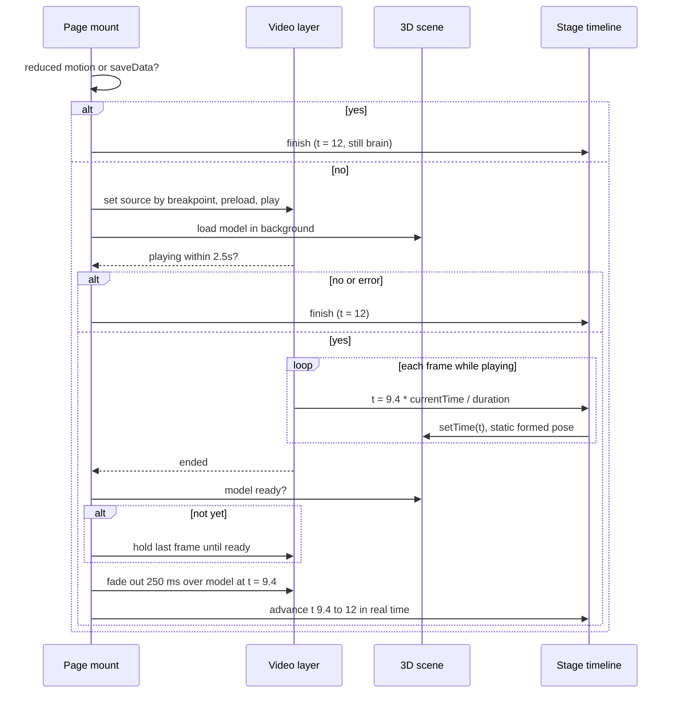

# Cinematic Brain Intro - Plan

## Goal Capsule

- **Objective:** A first-time visitor to the SOF homepage sees a photoreal, cinematic formation of the brain that reads as state-of-the-art and technical, and lands on the interactive 3D brain without a visible seam.
- **Means:** Replace the procedural 2D synapse intro with a Higgsfield-rendered clip bracketed by a dark first frame and the model's formed pose as last frame (KTD1, KTD2), played in a video layer that hands off to the existing 3D scene (KTD3).
- **Authority:** The user owns look, spend, and the proof-clip acceptance gate. Requirements govern behavior; KTDs govern mechanism within them.
- **Execution profile:** Local, iterative, browser-verified through the existing CDP capture scripts. Higgsfield generation spends the user's credits and runs only at the two gated units.
- **Stop conditions:** Stop after U2 until the user accepts the proof clip (R12). Stop before any final render if the balance cannot cover both finals plus one retake (R13). Stop if the proof clip's last frame does not visibly match the end image; return to prompt or model choice rather than adjusting the page.
- **Tail ownership:** Deliver the wired homepage with local browser evidence. Commit, push, and PR are outside this plan.

---

## Product Contract

Product Contract preservation: the three Outstanding Questions deferred to planning are resolved in place by KTD3, KTD5, and KTD6; R6 and Scope Boundaries changed — the signal labels are retired with the particle engine (KTD7), so R6 now names only the wordmark; R9 changed — clip choice follows stage orientation rather than device class (KTD8). Everything else is unchanged.

### Summary

Render a cinematic synapses-to-brain clip with Higgsfield, ending on the exact formed pose of the existing 3D model, and play it as the homepage intro. A separate vertical clip serves phones. The wordmark, light shift, and explore state that follow stay as they are today.

### Problem Frame

The homepage intro is a procedural particle animation drawn on a 2D canvas over the 3D model. It is faithful to the original Signal design, but it is abstract dots and lines, and it cannot reach the photoreal materials, volumetric light, and depth that the user associates with a state-of-the-art quant fund. The reference the user named, worldquant.com, gets its futuristic feel from precise typography and data motifs; SOF wants that feel carried by the brain itself.

The 3D model that the intro lands on is already approved. Any new intro must end where that model begins, or the visitor sees two different brains.

### Key Decisions

- **Rendered video intro, not a rebuilt procedural animation.** (session-settled: user-directed — chosen over using generated frames as reference for rebuilding the canvas animation, and over a video-plus-procedural blend: photoreal materials and light are the goal, and only a rendered clip reaches them.) Governs R1, R3.
- **End-frame lock: the clip ends on a render of the real 3D model.** (session-settled: user-directed — chosen over a one-second crossfade between a similar brain and the model: the seam must be invisible.) Governs R4, R5.
- **The technical layer stays in code over a clean clip.** (session-settled: user-directed — chosen over baking HUD elements and typography into the video: AI text is unreliable and baked elements cannot be edited without re-rendering.) Governs R6, R7.
- **A separate 9:16 clip for phones.** (session-settled: user-directed — chosen over a center crop of the landscape clip: better framing on phones is worth double the generation credits.) Governs R9.
- **Proof clip before finals.** (session-settled: user-directed — chosen over rendering 1080p finals immediately or the cheapest reversed-clip approach: one 720p test validates the end-frame lock and the look while keeping retake room within the 204-credit balance.) Governs R11, R12.
- **When the clip cannot play, skip to the still brain.** (session-settled: user-approved — chosen over keeping the particle intro as a fallback: one intro path is simpler to maintain and the still brain already serves reduced motion and failures.) Governs R8.

### Requirements

**The clip**

- R1. The intro is a rendered video in which synapses and light converge to form the brain, with photoreal materials, volumetric light, and depth of field, on the dark stage color the hero already uses.
- R2. The clip runs about ten seconds, close to the current intro's pacing, with no audio.
- R3. The brain that forms in the clip matches the look of the existing 3D model: the same glossy blue material, the same lateral view, the same lighting mood.
- R4. The clip's final frame is a render of the real 3D model in its formed pose, supplied to the generator as the end image, so the last video frame and the first interactive frame are the same picture.
- R5. The clip contains no text, HUD elements, labels, or logos.

**On the page**

- R6. The clip replaces the procedural particle intro as the opening of the homepage. The SOF wordmark type-on may play over the clip as it does today.
- R7. Everything after the formed pose is unchanged: the light shift, the brain moving aside, the wordmark docking into the header on scroll, region pins, orbit, zoom, replay, and skip.
- R8. When the clip cannot start within a short wait, or the visitor prefers reduced motion or reduced data, the page goes straight to the still brain and the interactive state, exactly as skipping the intro does today.
- R9. Portrait stages, phones above all, receive a separately rendered 9:16 clip with the same end-frame lock, framed for the mobile hero. Landscape stages receive the 16:9 clip.
- R10. The 3D model keeps loading while the clip plays, and the swap waits for the model when it arrives late, so the visitor never sees the clip end on an empty stage.

**Production**

- R11. A single 720p proof clip is rendered first, on the cheapest model that supports an end image, before any final.
- R12. Finals are rendered at 1080p only after the user has viewed the proof clip and accepted the look and the end-frame match. The user chooses the model for finals at that point.
- R13. Total generation spend stays within the current Higgsfield balance of 204 credits, including at least one retake round.

### Key Flows

- F1. First visit on desktop
  - **Trigger:** The homepage loads with motion allowed.
  - **Steps:** The dark stage shows the clip's first frame; the clip starts as soon as it can play; the 3D model loads in the background; the clip ends on the formed pose; the interactive model is revealed in the same pose; the existing light shift and wordmark sequence continue.
  - **Outcome:** One continuous shot from synapses to the interactive brain.
  - **Covered by:** R1, R4, R6, R7, R10

- F2. Clip unavailable
  - **Trigger:** The clip has not started within the wait, or the visitor prefers reduced motion or reduced data, or the video fails.
  - **Steps:** The page skips the clip and shows the still brain in its resting state with the wordmark already docked.
  - **Outcome:** The visitor reaches the same interactive page without the cinematic opening.
  - **Covered by:** R8

- F3. Producing the clips
  - **Trigger:** The formed-pose render of the 3D model exists.
  - **Steps:** Render one 720p 16:9 proof clip with the end image; the user reviews it; on acceptance, render the 16:9 and 9:16 finals at 1080p on the chosen model; place both clips in the site; verify the end-frame match in the browser.
  - **Outcome:** Two approved clips wired into the homepage.
  - **Covered by:** R4, R9, R11, R12, R13

### Acceptance Examples

- AE1. **Covers R4, R10.** Given the clip's last frame and the model's first interactive frame, a viewer stepping frame by frame at the swap cannot tell which frame is video and which is the model.
- AE2. **Covers R8.** Given a visitor with reduced motion enabled, the homepage shows the still brain immediately and never plays the clip.
- AE3. **Covers R8.** Given a connection where the clip cannot start within the wait, the page shows the still brain rather than a black stage.
- AE4. **Covers R9.** Given a 390-pixel-wide phone, the vertical clip plays with the brain framed in view, and it ends on the model in the same pose the phone layout uses.
- AE5. **Covers R12.** Given the proof clip has been rendered but not accepted, no 1080p final has been generated.

### Success Criteria

- The intro reads as cinematic and technical to the user, in the spirit of worldquant.com, judged on the proof clip before finals.
- The swap from clip to model is invisible at normal playback speed on desktop and phone.
- The clip does not delay the page's usable state: navigation, skip, and scrolling remain available while it plays.

### Scope Boundaries

- No new HUD, data-readout, or typography layer beyond the wordmark already in code. A richer WorldQuant-style technical layer is a possible follow-up.
- No audio.
- No changes to the 3D model, its materials, region interaction, or the sections below the hero.
- The procedural particle intro is retired from the default path, not rebuilt.

#### Deferred to Follow-Up Work

- Long-lived cache headers for `public/brain/` assets (the clips and the model) with versioned filenames, so browsers keep them across visits.
- A poster image extracted from the clip's first frame, if a first frame that is not plain stage color is ever wanted.

### Dependencies / Assumptions

- Higgsfield generation is billed in credits; balance at brainstorm time is 204. A ten-second 1080p clip costs 45 credits on Gemini Omni Flash and 90 on Seedance 2.5 or FLUX 3 Video; 720p Gemini is about 30. Seedance, FLUX, and Gemini accept an end image; Kling Turbo does not.
- AI video may not reproduce the end image perfectly; the proof clip is the check.
- The site's Content-Security-Policy in `next.config.ts` sets `default-src 'self'` with no `media-src`, so a self-hosted clip under `public/` plays without a policy change.
- No `ffmpeg` is installed on the development machine; the plan never depends on local video processing.

### Sources / Research

- Current intro and hero: `src/lib/brain/intro.ts`, `src/components/brain/BrainExperience.tsx`, `src/lib/brain/scene.ts`, `src/components/brain/BrainExperience.module.css`.
- Browser verification pattern: `design/brain/qa/cdp.mjs` (`openPage`, `until`, `pause`) with `Page.bringToFront` against the debug Chrome on port 9223; `design/brain/qa/verify-intro.mjs` shows the slow-model and blocked-request techniques through `Fetch.enable`.
- Higgsfield model catalog and costs gathered during the brainstorm; no bundled Higgsfield workflow covers this clip, so generation is direct through `generate_video`.
- Reference site named by the user: worldquant.com.

---

## Planning Contract

### Key Technical Decisions

- KTD1. **The end image and the start image are captured from the page itself through a development-only pose mode.** A `pose` query parameter, honored only in development, renders the stage with the model at its formed pose (`formed`) or with the model hidden (`empty`), no overlays, stage color ink. A CDP script screenshots the stage at 1920x1080 and 1080x1920. This is the only way the end frame carries the page's exact camera, lighting, and material. Governs U1.
- KTD2. **The clip is bracketed by both keyframes: `empty` as start image, `formed` as end image.** (session-settled: user-approved — chosen over an end image only: the model would otherwise invent the opening frame, and a solid stage-color opening lets the video sit on the stage with no visible edge.) Generation runs on Gemini Omni Flash 1.1 in `image-to-video` mode for the proof; the user picks the final model at the gate per R12. Governs U2, U3.
- KTD3. **The clip drives the hero timeline until it ends, then the code timeline takes over at the formed moment.** The existing stage timeline runs 0 to 12 seconds; the model is fully formed and unshifted at 9.4. While the clip plays, timeline time equals `9.4 * currentTime / duration`, so the wordmark type-on lands over the clip's last stretch. On `ended`, the video layer fades out over about 250 milliseconds above the already-rendered model at 9.4, then time advances in real time to 12 for the light shift and move-aside. This keeps the wordmark, docking, and explore code untouched (R7). Resolves the first deferred question. Governs U4.
- KTD4. **The scene keeps its `forming` phase but loses the pullback and sway.** With the particle intro gone, the model no longer needs to fly in or breathe: material opacity is 1 throughout, rotation stays zero, and the faint network fades in from 9.4 to 10.6 after the swap. A static model is what the end image shows, so the swap has nothing to drift. These scene changes land in U1 before any frame is captured, and any later change to the formed look at 9.4 requires re-capturing and diffing the end frames before a final is rendered, so a paid clip is never locked to a look the page has moved past. Governs U1, U4.
- KTD5. **The video is always scaled to the stage height and centered.** On stages wider than the clip, stage-colored margins appear on both sides; on narrower stages the sides are clipped. Both keep the video brain's height equal to the model's, because the perspective camera scales the model with stage height. Encoded video black will not match the stage color exactly, and most maximized desktop windows are wider than 16:9, so the video's left and right edges are feathered with a horizontal gradient mask (transparent at the edges, opaque from about 8 to 92 percent) so no hard boundary shows. While a clip is matched, the scene's aspect-scale factor is driven by the clip's aspect, `min(1, clipAspect * 1.05)`, regardless of stage aspect, so the model matches the height-fitted video on every stage; after the swap it interpolates to the stage's own factor across the existing 9.4 to 10.6 shift window, so the resting brain keeps today's size. Resolves the third deferred question. Governs U4.
- KTD6. **Wait budget and fallbacks.** The video is given 2.5 seconds from mount to reach `playing`; otherwise, or on `error`, the page finishes to the still brain. After playback has started, a `waiting` event not followed by `playing` within about 1.5 seconds also finishes to the still brain through the same path Skip uses, so a stalling clip never leaves the timeline and wordmark frozen. Reduced motion and `navigator.connection.saveData` skip the clip before it is requested. If the clip ends before the model is ready, the video stays on its last frame and the swap waits for readiness (R10). The 3D canvas stays hidden until the swap begins and is revealed just before the fade, so a model that loads before the clip's first frame decodes never flashes through. Resolves the second deferred question. Governs U4, U5.
- KTD7. **The particle intro engine is removed, not parked.** `src/lib/brain/intro.ts`, its canvas, and its two QA scripts are deleted. The whole brain hero is untracked on this branch, so history holds nothing yet: U4 commits the current brain work, or copies the engine and its scripts to `design/brain/retired/`, before the deletion step, and that step is what preserves them. The signal labels lived inside that engine and go with it; the wordmark type-on stays. Governs U4.
- KTD8. **Clip source is chosen once at mount by stage orientation.** A stage taller than it is wide gets the 9:16 clip; otherwise the 16:9 clip. This keeps portrait tablets on the vertical clip and small landscape phones on the landscape clip, where a width breakpoint would send each the wrong one. Orientation changes mid-play are ignored. Governs U4.
- KTD9. **Clips live in `public/brain/` as MP4 and are committed, under a size ceiling.** The GLB already sets the precedent for a multi-megabyte asset in the repo. Each final must be at most about 6 MB for 16:9 and 4 MB for 9:16, so the wait budget and phone data cost are tuned against a known payload; a final over the ceiling is re-encoded before it lands (through the Higgsfield sandbox if it provides ffmpeg, otherwise on another machine) rather than committed raw. Cache headers are deferred (Scope Boundaries). Governs U3.

### High-Level Technical Design

Stage layer order, bottom to top: signal field, still-image fallback (hidden unless failed), 3D canvas (hidden until the swap begins), video layer (hidden after the swap), wordmark, pins, controls.

### Assumptions

- Gemini Omni Flash 1.1 `image-to-video` accepts `start_image` and `end_image` together. The proof clip is the check; if only one keyframe is honored, U2 falls back to end image only and notes it.
- The debug Chrome on port 9223 remains available for capture and verification, as it was for the previous intro.

### Sequencing

U1 first, because every render needs the frames it produces. U2 next and stop for acceptance. U4 proceeds with the proof clip as a stand-in asset, so integration does not wait on finals. U3 renders finals once accepted and replaces the stand-in. U5 verifies end to end with the finals in place.

---

## Implementation Units

### U1. Pose modes and keyframe capture

- **Goal:** Produce `formed` and `empty` stage frames at 1920x1080 and 1080x1920 from the real page.
- **Requirements:** R4, R9; KTD1.
- **Dependencies:** None.
- **Files:** `src/components/brain/BrainExperience.tsx` (pose query handling), `src/lib/brain/scene.ts` (the KTD4 scene changes: static formed pose, opacity 1, network fade after 9.4), `design/brain/qa/capture-pose.mjs` (new), `design/brain/video/end-16x9.png`, `design/brain/video/end-9x16.png`, `design/brain/video/start-16x9.png`, `design/brain/video/start-9x16.png` (new outputs).
- **Approach:**
  1. Land the KTD4 scene changes first: remove the pullback and sway from the forming branch, keep material opacity at 1, fade the network in from 9.4 to 10.6. The formed look at 9.4 is frozen from this point; any later change to it re-runs the capture script and diffs against the committed end PNGs before any final is rendered.
  2. In development only, read a `pose` query parameter on mount from the window location inside the existing mount effect, not through the router hook. `formed`: no intro, phase forming with time held at 9.4, wordmark, pins, controls, scroll cue, and signal field hidden, stage color ink. `empty`: same but the 3D canvas hidden.
  3. Production ignores the parameter.
  4. The capture script opens the page with the debug Chrome, sets a 1920x1152 viewport for desktop (stage is the 1080 below the 72-pixel header) and 1080x1992 for the phone frame, waits for `data-brain-ready=true`, and screenshots the stage's bounding box.
- **Patterns to follow:** `design/brain/qa/capture-intro.mjs` for the capture loop; `Emulation.setDeviceMetricsOverride` with `mobile: true` for the phone frame.
- **Test scenarios:**
  - Opening the homepage with `?pose=formed` in development shows the model centered on a dark stage with no text or controls.
  - Opening with `?pose=empty` shows only the dark stage.
  - Opening with `?pose=formed` in a production build plays the normal intro.
  - The four PNGs exist at the exact pixel sizes and the two `end` frames show the brain at the same relative height.
- **Verification:** The four frames viewed side by side; the `formed` frame matches the model's look on the live page at rest apart from the shift and light.

### U2. Proof clip through Higgsfield

- **Goal:** One 720p 16:9 proof clip that opens on the stage color and ends on the formed pose, presented to the user for acceptance.
- **Requirements:** R1, R2, R3, R5, R11, R12; KTD2.
- **Dependencies:** U1.
- **Files:** `design/brain/video/README.md` (new: model, prompt, settings, job id, and cost per render).
- **Approach:**
  1. Upload the two 16:9 frames with `media_upload`, PUT the bytes to the presigned URLs, then `media_confirm`.
  2. Preflight cost with `get_cost`, then `generate_video` on `gemini_omni_flash_1_1`, mode `image-to-video`, duration 10, 720p, aspect 16:9, `start_image` and `end_image` set, prompt describing luminous synapses and neural fibers converging out of darkness into a glossy blue metallic brain seen from the side, cinematic volumetric light, shallow depth of field, no text.
  3. Wait for the job, display it, and stop for the user's decision. Record the prompt and cost in the README.
- **Execution note:** This spends credits. Confirm with the user before submitting, and do not retry without asking.
- **Test scenarios:** Test expectation: none -- generation is a manual, credit-spending step judged by the user; the checks are AE5 (no final rendered before acceptance) and a visual comparison of the clip's last frame against `end-16x9.png`.
- **Verification:** The user accepts or rejects the clip. On rejection, adjust prompt or model and return here; never adjust the page to meet the clip.

### U3. Final clips

- **Goal:** Accepted 16:9 and 9:16 clips at 1080p placed in the site.
- **Requirements:** R9, R12, R13; KTD2, KTD9.
- **Dependencies:** U2 accepted.
- **Files:** `public/brain/intro-16x9.mp4`, `public/brain/intro-9x16.mp4` (new), `public/brain/attribution.txt` (add the clip provenance line), `design/brain/video/README.md`.
- **Approach:**
  1. Preflight both renders on the user's chosen model and confirm the balance leaves one retake round.
  2. Render 16:9 with the 16:9 frames and 9:16 with the 9:16 frames at 1080p, 10 seconds, no audio.
  3. Download each result to `public/brain/` and record job ids and costs.
  4. Check that each MP4 is fast-start: a short Node script reads the top-level box headers and confirms the `moov` box precedes `mdat`. A clip that is not fast-start is remuxed before it lands in `public/brain/` (through the Higgsfield sandbox if it provides ffmpeg, otherwise on another machine), and the README records it.
- **Execution note:** Spends credits; confirm before each submission.
- **Test scenarios:**
  - Both files play in Chrome from the dev server at their paths.
  - Each file's `moov` box precedes its `mdat` box.
  - The 16:9 file is at most about 6 MB and the 9:16 file at most about 4 MB; a larger final is re-encoded before it lands.
  - Each clip's last frame matches its `end` PNG by eye at 100 percent.
  - Recorded spend for the whole plan stays under 204 credits with at least one retake's worth remaining.
- **Verification:** Files present and playable; README complete.

### U4. Video intro integration

- **Goal:** The homepage opens with the clip, hands off to the model at the formed pose, and falls back per R8.
- **Requirements:** R6, R7, R8, R9, R10; KTD3 through KTD8; F1, F2.
- **Dependencies:** U1; a clip file from U2 (stand-in) or U3.
- **Files:** `src/components/brain/BrainExperience.tsx`, `src/components/brain/BrainExperience.module.css`, `src/lib/brain/scene.ts`; delete `src/lib/brain/intro.ts`, `design/brain/qa/capture-intro.mjs`, `design/brain/qa/verify-intro.mjs`.
- **Approach:**
  1. Replace the intro canvas with a `video` element: muted, `playsInline`, `preload="auto"`, no controls, source chosen per KTD8, sized per KTD5 (height 100 percent, width auto, centered, stage clips overflow), above the 3D canvas. The 3D canvas stays hidden (extend the existing `data-ready` visibility rule with a swap attribute) until the swap begins.
  2. Drive the timeline per KTD3 from `timeupdate` or a frame loop reading `currentTime`, feeding `paint` and `scene.setTime`.
  3. Apply KTD6: reduced motion or saveData finishes before requesting the clip; a 2.5-second timer from mount finishes if `playing` has not fired; `error` finishes; after playback starts, a `waiting` not followed by `playing` within about 1.5 seconds finishes through the Skip path.
  4. On `ended`, if the scene is not ready, wait; then reveal the 3D canvas at 9.4, fade the video out over 250 milliseconds, and start a real-time clock from 9.4 to 12, after which phase becomes `still` as today.
  5. Skip intro and a click on the video finish as today. Replay resets the clock, seeks the video to 0, and plays again.
  6. In `scene.ts`, while a clip is matched drive the aspect-scale factor from the clip's aspect, then interpolate to the stage's factor across the shift window after the swap (KTD5); the forming-branch changes already landed in U1. Feather the video's side edges with the gradient mask from KTD5.
  7. Commit the current untracked brain work, or copy `src/lib/brain/intro.ts` and its two QA scripts to `design/brain/retired/`, then delete the particle engine and its scripts and remove the `intro` canvas CSS (KTD7).
- **Execution note:** Prefer runtime smoke checks in the debug Chrome over unit tests; the repo has no test runner, and the behaviors are visual and timing-based.
- **Patterns to follow:** The existing `finish`, `playing`, and `held` handling in `BrainExperience.tsx`; the `hidden` attribute plus `[hidden]{display:none}` CSS convention; `data-*` attributes on the stage for scripts to read state.
- **Test scenarios:**
  - Covers F1. Desktop load with motion allowed: the clip plays, `currentTime` advances, the wordmark types on during the clip's last stretch, the model appears at the swap with no jump, then the light shift and move-aside run.
  - Covers AE1. Screenshots of the last video frame and the first model frame differ by less than a small pixel threshold across the brain region.
  - Covers AE2. Reduced motion emulated: the video element never receives a source and the page is at the still state immediately.
  - Covers AE3. Clip request blocked: within about 2.5 seconds the page is at the still state with no black stage.
  - Covers R10. Model request held for 12 seconds: the clip ends and holds on its last frame, then the swap happens once the model arrives, with no empty stage.
  - Model ready before the clip's first frame (cached model, throttled clip): the finished brain never shows before the clip starts.
  - Throttled network at about 1.5 Mbps after playback starts: a stall longer than the watchdog reaches the still state rather than a frozen frame.
  - Covers AE4. 390x844 mobile emulation: the 9:16 source is selected and the brain stays in frame through the swap.
  - Skip intro during the clip: video stops and hides, page at still state, controls usable.
  - Replay after the swap: the clip plays from the start and the sequence repeats.
  - A 21:9 stage: video has invisible side margins and the brain height matches the model at the swap.
  - A 1366x768 window: a mid-clip screenshot shows no hard vertical edge where the video meets the stage.
  - A 768x1024 portrait tablet: the 9:16 source is selected and the brain height matches the model at the swap.
  - Scrolling during the clip finishes the intro as today and the wordmark docks into the header.
- **Verification:** Every scenario above passes in the debug Chrome; `npx tsc --noEmit` and `npx eslint src` are clean; no reference to `intro.ts` remains.

### U5. End-to-end verification script

- **Goal:** A repeatable CDP script that captures the swap and the fallbacks with the final clips in place.
- **Requirements:** R8, R10; AE1 through AE4.
- **Dependencies:** U3, U4.
- **Files:** `design/brain/qa/verify-video-intro.mjs` (new), `design/brain/qa/video/` (screenshots).
- **Approach:** Port the structure of the deleted `verify-intro.mjs`: normal load with timed screenshots around the swap, reduced-motion load, blocked-clip load, held-model load, mobile load, a throttled cold-cache load (`Network.emulateNetworkConditions` at about 4 Mbps) asserting the clip reaches `playing` inside the budget, and a mid-clip stall (about 1.5 Mbps) asserting the still state is reached. Compute a simple pixel difference between the last video frame and the first model frame and print it.
- **Test scenarios:**
  - The script runs to completion against the dev server and prints the swap difference and each fallback state.
  - Its screenshots show no black stage in any fallback case.
- **Verification:** Screenshots reviewed; the swap difference is below the threshold chosen in U4.

---

## Verification Contract

| Scope | Command or evidence | Pass condition |
|---|---|---|
| Types and lint | `npx tsc --noEmit -p .` and `npx eslint src` | No errors |
| Keyframes (U1) | `node design/brain/qa/capture-pose.mjs` | Four PNGs at exact sizes; formed frames match the live model |
| Proof clip (U2) | Higgsfield job displayed to the user | User acceptance recorded before U3 |
| Finals (U3) | Files in `public/brain/` play from the dev server | Both clips play; last frames match their end PNGs |
| Integration (U4, U5) | `node design/brain/qa/verify-video-intro.mjs` against `http://127.0.0.1:3000` | All scenarios pass; swap difference under threshold; no black stage in fallbacks |
| Production build | `npm run build` from the user's terminal | Build succeeds (Google Fonts cannot be fetched from the agent shell) |

The Claude-in-Chrome automation tab reports `document.hidden` as true, which pauses both canvases; verify through the CDP scripts with `Page.bringToFront`, not through that tab.

---

## Definition of Done

- The homepage opens with the accepted 16:9 clip on desktop and the 9:16 clip on phones, and hands off to the interactive model with no visible seam.
- Reduced motion, saveData, a blocked clip, and a late model each reach the still or interactive brain with no black stage.
- Skip, replay, scroll docking, region pins, orbit, and zoom behave as before.
- `intro.ts`, its canvas, and its QA scripts are gone; no dead intro code remains.
- Spend is recorded in `design/brain/video/README.md` and stayed within the balance with a retake in reserve.
- Type check and lint are clean; the verification script's screenshots are saved.

---

## Deferred / Open Questions

### From 2026-09-06 review

- **Replay after a fallback (U4).** When the clip failed, timed out, or was skipped for reduced motion or reduced data, the plan does not say whether Replay retries the clip (risking the same stall and another wait) or replays only the code-driven light shift and move-aside. Decide before U4 step 5 is built. (design-lens)
- **Numeric threshold for the invisible swap (U4, U5).** AE1 and the verification script gate on "below the threshold chosen in U4" with no value or method. Decide the measure (for example mean absolute difference per channel over the brain region), the value, and whether desktop and phone get separate thresholds given the phone canvas renders at a lower pixel ratio than the clip. Decide before the U5 script is written. (design-lens, feasibility)
